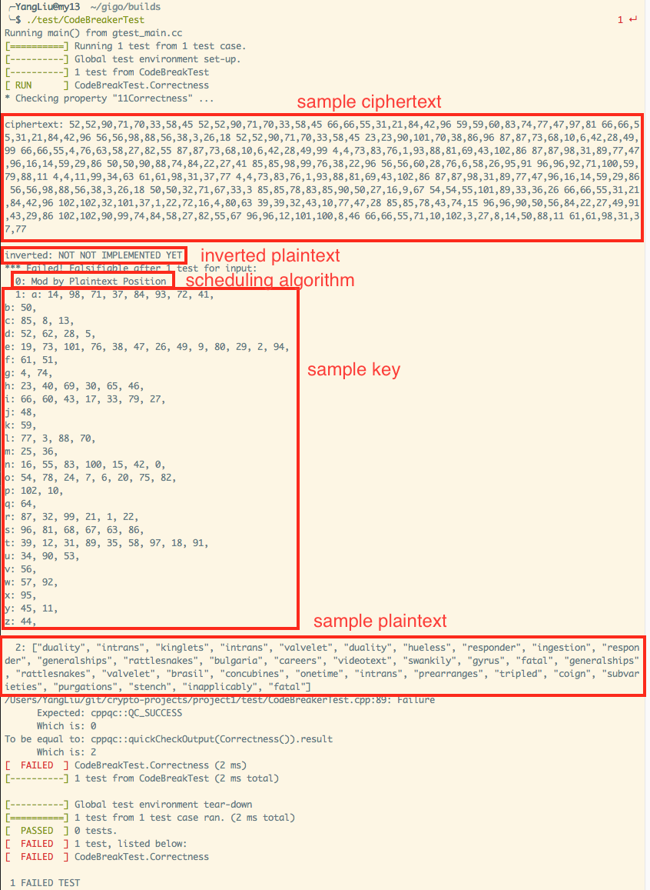

# Cryptanalysis of Permutation Ciphers
[](https://floobits.com/robturtle/crypto-projects/redirect)

## Test framework
First, build the project like the normal CMake project:

```
mkdir -p /some/where/to/build/
cd /some/where/to/build/
cmake /path/to/project1
make
```

Simply execute `./test/CodeBreakTest` to test the correctness of the implementation.
The test suite will:
- generate a random key
- select one scheduling algorithm from all pre-defined ones (currently only the "Mod by Plaintext Position" is valid)
- randomly pick one dicionary from 5, and randomly pick some words to build up the plaintext
- encrypt the plaintext to yield ciphertext (numbers separated by ',', words separated by ' ')
- execute `CodeBreaker().solve(ciphertext)` and see whether the inverted text is equal to plaintext

Once the test failed, a detailed message will be output like this:



To make the test passed, go to `src/CodeBreaker.cpp` and implement the `_solve()` method correctly:
``` cpp
vector<string> _solve(vector<string> ciphers);
```
It accepts an vector of cipher (example: ["118,58,23", "78,29,4,102,112,25"]), and it should crack
the cipher and return the corresponding plaintext word as an vector. (NOTE: the order of each element must be
preserved).

### Facilities
Dictionaries are stored in `cipher::dictionaries` as `vector<vector<string>`, each element represents one line
of words in the `plaintext_dictionaries.txt`.

Function `vector<string> split(content, separator)` can be used to split words.

Function `string join(vector<T>, separator)` can be used to join an vector into a single string.

Once a test is passed, a csv record will be logged into `resources/break.log` with fields:
"break time in seconds", "plaintext", and "scheduling algorithm". This can be used for further
analysis.

## Observations

The [dictionary](resources/plaintext_dictionary.txt) is now published. From the contents we can tell
that the size of the dictionary is pretty small. And since each word is independent. We could try to
start it from the easiest one, i.e. the one who has the least candidates.

We split the dictionary by its word's length, take the 1st dictionary for example, we will got something 
like this:
```ruby
{
 7=>["sconced", "coastal", "anthrax", "polypus", "kayaker", "william", "blunted", "cumquat", "aniline", "academe", "rebukes", "swagmen"],
 5=>["pouch", "colly", "lacer"],
 6=>["bogart", "lights", "philip", "resins", "kevils", "dredge"],
 12=>["nonexplosive", "outstripping", "underbidding", "corespondent"],
 8=>["shriller", "trembler", "research", "parapets", "breveted", "cyanosis", "obstacle"],
 11=>["nightshirts", "unresistant", "concertizes"],
 13=>["editorializer", "industrialist"],
 10=>["gratuitous", "almightily", "endoscopes", "ostensible"],
 9=>["pyrometer", "scoutings", "agileness", "toothpick", "atavistic"],
 14=>["psychoneurosis"],
 4=>["hake"],
 17=>["incompressibility"],
 15=>["nondistribution", "plenipotentiary"],
 1=>["p"]
}
```

As we can see, candidates of the word length 1, 4, 14, and 17 are only of size 1. That is to say, once we came 
across ciphertext with such length, we can immediately get its corresponding plaintext word and the partial 
key mapping of. The we could go through words with 2 candidates, words with 3 candidates, and so on.

And for which have the same amount of candidates, of cause we should start checking from the longest one for 
it can bind more key mappings in the early stage, hence we might detect the mapping conflicts earlier.

Based on the knowledge learned from the dictionary, let's reconsider the key space. We know that the whole 
length of the ciphertext is around 500. Considering it's built up with 72 word of each has the length of 7.
The size of the key space will be |map[7]|^72 = 12^72. It's impractical to iterate from it. But if we go through 
the depth-first search, we can easily prune based on the pre-binded key mappings.

In order to make the conflict appear as soon as possible, we could sort the sub-dictionaries by letting the word 
with the least fault tolerance take the beginning position.

The fault tolerance should be calculated as: FT(word) = Π (slot number of each letter).

For example, the fault tolerance of "aet" = 8 * 13 * 9 = 936

### Mod by Plaintext Position Scheduling Algorithm
It's obviously that the heading elements in the list for each letter is more likely appear in the ciphertext.
That makes the shortest word to longest strategy more efficient.

## Iteration
The search space in the dictionary is very small. So let's just do Depth-First Search to find the key.

P.S. I tried the excercise in the KL book which request you break a mono substitution cipher where there's
no space serparating words. That search space is so huge that the DFS and BFS just not worked. In that case,
a randomized iterating method should be better.

``` python
def break(word):
    # placeholder for recursion base here
    candidates = select from dictionary where plaintext.len == word.len
    for candidate in candidates:
        make each letter in candidate map to each integer in word
        break(next word) # if all words can be mapped correctly, job done; otherwise trace back to this for loop
        revoke the mapping of this candidate
```

## Potential Additional Work
Some guess of the mechanism of the scheduler might be helpful. And we need to figure out some scheduling method
to complete the test suites. But let's just put this analysis after the first implementation.
